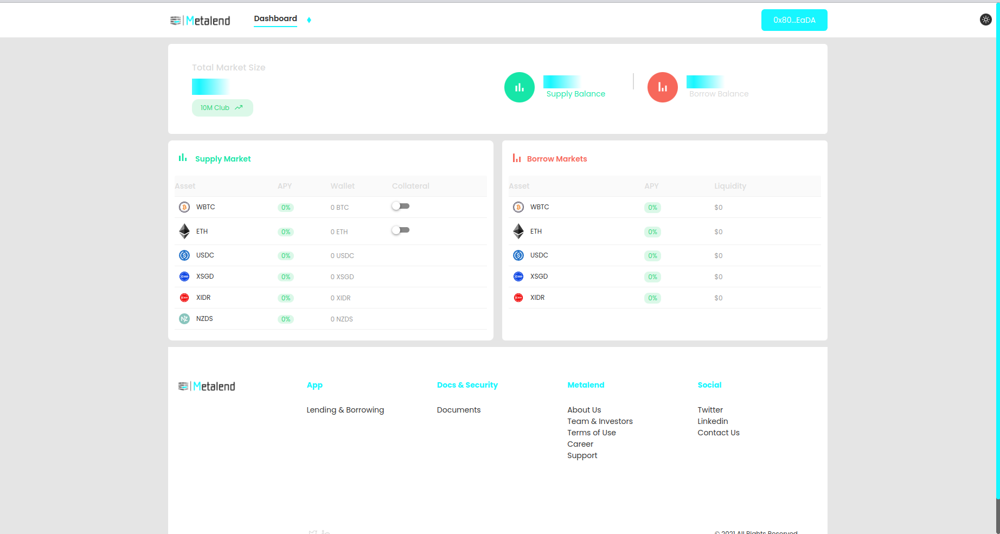
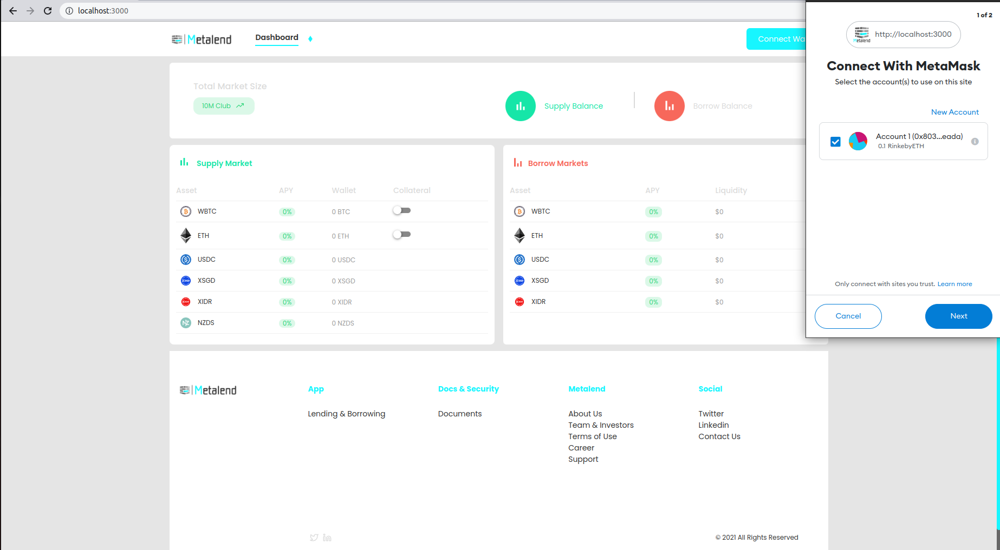
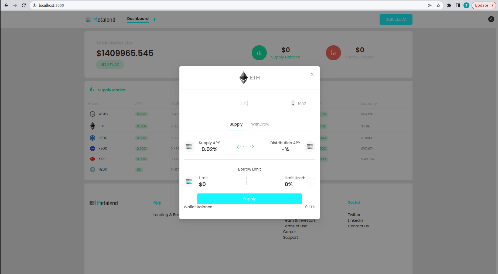
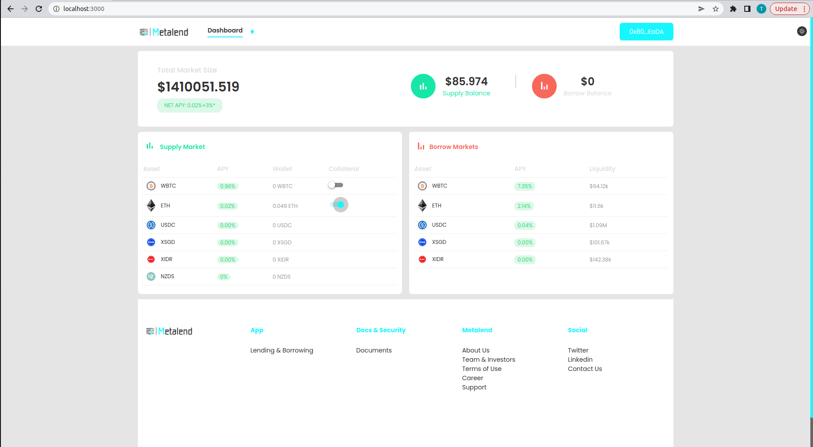
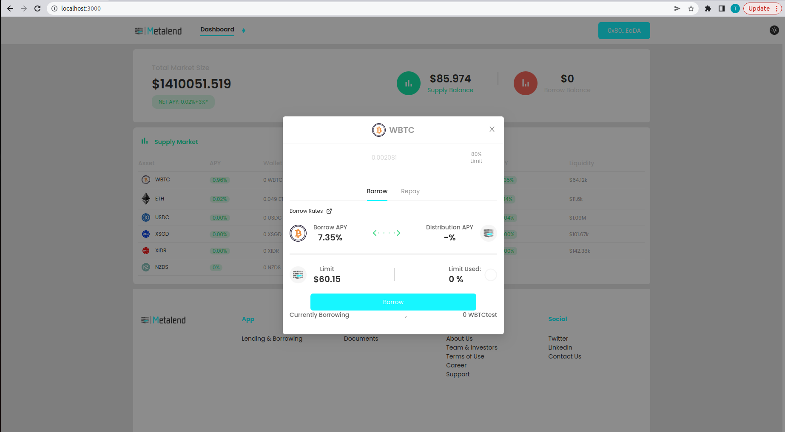
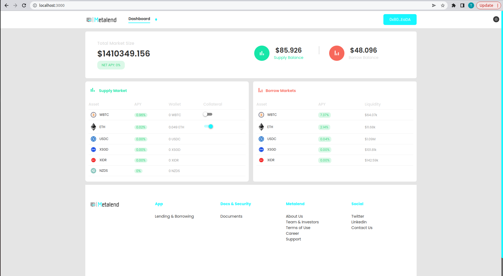
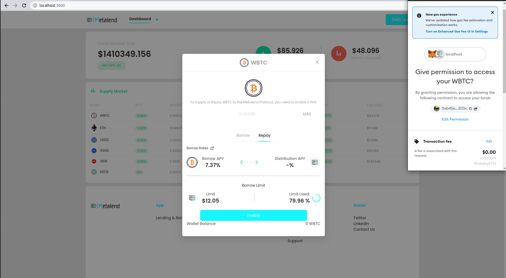
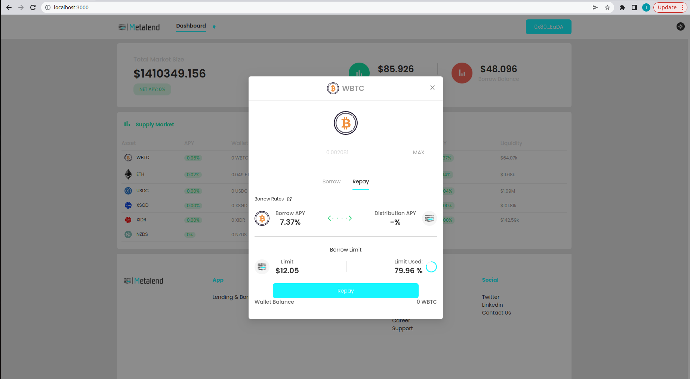
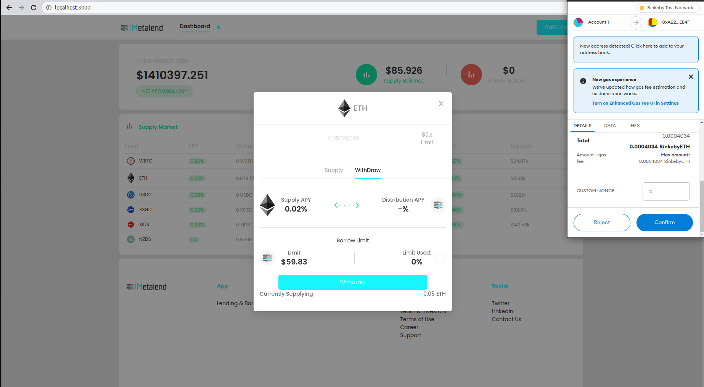
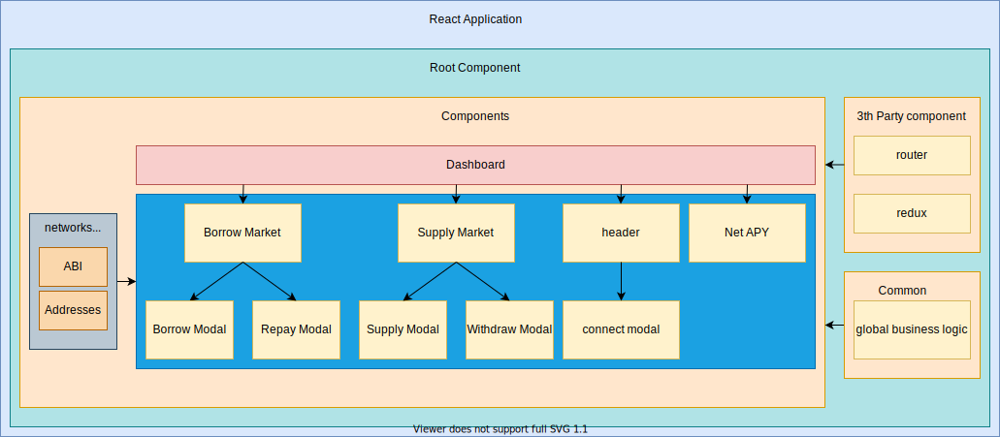

# How to borrow and lend assets on the blockchain?

Difficulty: Beginner

# Introduction

The crypto currency market has mimicked and expanded the traditional financial industry. The traditional bank institution is based on trust when it comes to borrowing and lending currencies. The blockchain is pseudo anonymous, every user is identified by an unique number the address of the wallet (ex. 0x8032F7F57B10B4a17A4C36d49D8BAcE1bfe0EaDA). 

A wallet address is a string of letters and numbers from which cryptocurrencies or NFTs can be sent to and from. A wallet address is also known as a Public Key and can be shared with different contacts like an email address.

The use of wallet addresses gives no room for borrowing and lending based on trust. 

The decentralized financial institutions solve this problem by implementing collateral and algorithmic tracking of the health of the loan, to elamite risks.

The project I will be explaining is public available at:

https://app.metalend.finance/

With at the time of writing a total value of 100 000 dollar which has been decreasing since the crypto crash.

# Steps user interface

Make sure to use the rinkeby or mainnet chain, other chains are not supported and you will see the loaders to indicate this chain is not supported.

To use this website you will need a metamask wallet. You can install this extension trough the following link. This link will take you to the home page of metamask.

https://metamask.io

You will need ethereum test faucet to test this product without spending real ethereum. You can receive rinkeby test faucet by visiting the chailink website.

https://faucets.chain.link/rinkeby

# How to supply assets to the protocol?

Supplying assets is possible in 2 ways. You can leverage the interface or calling the smart contracts using a library. The libraries I used for this are the most well known libraries ethers and web3. In this article the ethers library will be demonstrated.


1) connect your wallet (ex Metamask)

2) select the assets you want to supply (ex Ethereum)
3) approve the smart contract to supply your assets. 
The enable button will allow the smart contract to redeem an infinite amount of erc20 tokens. You can disable this after supplying in your wallet settings.

4) put in the amount or supply all by selecting the max button, be aware that supplying will cost gas fees, be sure to hold an amount of ethers to successfully executing the transaction.

5) You can now see that the asset is successfully supplied to the protocol and displayed on the supply balance.


# How to borrow assets from the protocol?

To borrow assets you need to set your supplied assets as collateral. You can do this by toggling the collateral button on the user interface or by calling the enter market function on the c token smart contract.


1) set you supplied assets as collateral

2) select the assets you want to borrow (ex Ethereum)


3) put in the amount or borrow the 80% collateral limit, be aware that you can borrow more than the 80% limit, but increases your risk of liquidation.

4) You can now see that the asset is successfully borrowed to the protocol and displayed on the borrow balance.



# How to repay assets from the protocol?

To repay the full amount of assets you need to have the amount of assets you borrow + interest rate. You can do this by selecting the borrowed asset and repay the maximum amount with the max button or by executing ethers code on the smart contract. 


1) select the assets you want to borrow (ex Bitcoin)
2) approve the protocol to redeem your tokens.


3) put in the amount or repay the maximum.

5) You can now see that the borrowed asset is successfully repay to the protocol and displayed on the borrow balance.


# How to withraw assets from the protocol?

To withdraw the assets you need either to have repaid all you debt's or other assets supplied as collateral need to be able to cover the loan. When you want to withdraw all assets you can exit the market by toggling the collateral button. The withdraw will be done automatically to your account. When partially withdrawing you can enter an amount in the input field.  


1) select the assets you want to withdraw (ex Bitcoin)


2) put in the amount or use 80% limit to withdraw the maximum for a healthy loan profile and avoid liquidation.



# Steps calling smart contracts leveraging ethers
## How to supply and withdraw assets from the protocol leveraging ethers library?


### Supply and withdraw ether using ethers

You can change the jsonrpcProvider to an alchemy, infura or other http url provider.
This script will supply 1 ether and redeem it after the supply transaction is successful. You can adjust the script to your needs. The code waits until the transaction has 1 confirmation on the chain before it continues the code. This code is stripped from proper error handling. 

```
const ethers = require('ethers');
const provider = new ethers.providers.JsonRpcProvider('http://localhost:8545');

const privateKey = 'b8c1b5c1d81f9475fdf2e334517d29f733bdfa40682207571b12fc1142cbf329';

const wallet = new ethers.Wallet(privateKey, provider);
const myWalletAddress = wallet.address;

const contractAddress = '0x5578f2E245e932a599c46215a0cA88707230F17B';

const abiJson = // fetch json from network folder abi file the cEthAbi
const cEthContract = new ethers.Contract(contractAddress, abiJson, wallet);

const ethDecimals = 18; 

const main = async function() {
  let ethBalance = +(await provider.getBalance(myWalletAddress)) / Math.pow(10, ethDecimals);
  console.log("My wallet's ETH balance:", ethBalance, '\n');
  console.log('Supplying ETH to the Compound Protocol...', '\n');
  let tx = await cEthContract.mint({
    value: ethers.utils.parseUnits('1', 'ether')
  });
  await tx.wait(1); // wait until the transaction has 1 confirmation on the blockchain

  console.log('cETH "Mint" operation successful.', '\n');

  const bal = await cEthContract.callStatic.balanceOfUnderlying(myWalletAddress);
  const balanceOfUnderlying = +bal / Math.pow(10, ethDecimals);

  console.log("ETH supplied to the Compound Protocol:", balanceOfUnderlying, '\n');

  let cTokenBalance = +(await cEthContract.callStatic.balanceOf(myWalletAddress)) / 1e8;

  console.log("My wallet's cETH Token Balance:", cTokenBalance, '\n');

  let exchangeRateCurrent = await cEthContract.callStatic.exchangeRateCurrent();
  exchangeRateCurrent = exchangeRateCurrent / Math.pow(10, 18 + ethDecimals - 8);
  console.log("Current exchange rate from cETH to ETH:", exchangeRateCurrent, '\n');

  console.log('Redeeming the cETH for ETH...', '\n');

  console.log('Exchanging all cETH based on cToken amount...', '\n');
  tx = await cEthContract.redeem(cTokenBalance * 1e8);
  await tx.wait(1); // wait until the transaction has 1 confirmation on the blockchain

  // console.log('Exchanging all cETH based on underlying ETH amount...', '\n');
  // let ethAmount = (balanceOfUnderlying * Math.pow(10, ethDecimals)).toString()
  // tx = await cEthContract.redeemUnderlying(ethAmount);
  // await tx.wait(1); // wait until the transaction has 1 confirmation on the blockchain

  cTokenBalance = +(await cEthContract.callStatic.balanceOf(myWalletAddress)) / 1e8;
  console.log("My wallet's cETH Token Balance:", cTokenBalance);

  ethBalance = +(await provider.getBalance(myWalletAddress)) / Math.pow(10, ethDecimals);
  console.log("My wallet's ETH balance:", ethBalance, '\n');
}

main().catch((err) => {
  console.error(err);
});
```
### Supply and redeem erc20 tokens using ethers

Supplying erc20 tokens for the first time requires an additional function to approve the smart contract to access your erc20 tokens. 

```
const ethers = require('ethers');
const provider = new ethers.providers.JsonRpcProvider('http://localhost:8545');

const privateKey = 'b8c1b5c1d81f9475fdf2e334517d29f733bdfa40682207571b12fc1142cbf329';

const wallet = new ethers.Wallet(privateKey, provider);
const myWalletAddress = wallet.address;

// Mainnet Contract for cUSDC
const cTokenContractAddress = '0xca306809FE6A45fCba4347bAbb71d77c6875C8bf';
const cTokenAbiJson = // fetch json from network folder abi file cUSDCAbi
const cTokenContract = new ethers.Contract(cTokenContractAddress, cTokenAbiJson, wallet);


const underlyingContractAddress = '0xA0b86991c6218b36c1d19D4a2e9Eb0cE3606eB48';
const erc20AbiJson = 
const underlyingContract = new ethers.Contract(underlyingContractAddress, erc20AbiJson, wallet);

const assetName = 'USDC'; 
const underlyingDecimals = 6;

const main = async function() {
  const tokenBalance = await underlyingContract.callStatic.balanceOf(myWalletAddress) / 1e18;
  console.log(`My wallet's ${assetName} Token Balance:`, tokenBalance);

  const underlyingTokensToSupply = 10 * Math.pow(10, underlyingDecimals);


  let tx = await underlyingContract.approve(
    cTokenContractAddress, underlyingTokensToSupply.toString()
  );
  await tx.wait(1); 
  console.log(`${assetName} contract "Approve" operation successful.`);
  console.log(`Supplying ${assetName} to the Compound Protocol...`, '\n');


  tx = await cTokenContract.mint(underlyingTokensToSupply.toString());
  await tx.wait(1); // wait until the transaction has 1 confirmation on the blockchain

  const bal = await cTokenContract.callStatic.balanceOfUnderlying(myWalletAddress);
  const balanceOfUnderlying = +bal / Math.pow(10, underlyingDecimals);

  let cTokenBalance = +(await cTokenContract.callStatic.balanceOf(myWalletAddress)) / 1e8;
  console.log(`My wallet's c${assetName} Token Balance:`, cTokenBalance);

  let underlyingBalance = await underlyingContract.callStatic.balanceOf(myWalletAddress);
  underlyingBalance = +underlyingBalance / Math.pow(10, underlyingDecimals);
  console.log(`My wallet's ${assetName} Token Balance:`, underlyingBalance, '\n');

  let erCurrent = await cTokenContract.callStatic.exchangeRateCurrent();
  let exchangeRate = +erCurrent / Math.pow(10, 18 + underlyingDecimals - 8);

  console.log(`Exchanging all c${assetName} based on cToken amount...`, '\n');
  tx = await cTokenContract.redeem(cTokenBalance * 1e8);
  await tx.wait(1); // wait until the transaction has 1 confirmation on the blockchain

  // redeem (based on underlying)
  // console.log(`Exchanging all c${assetName} based on underlying ${assetName} amount...`);
  // let underlyingAmount = balanceOfUnderlying * Math.pow(10, underlyingDecimals);
  // tx = await cTokenContract.redeemUnderlying(underlyingAmount);
  // await tx.wait(1); // wait until the transaction has 1 confirmation on the blockchain

  cTokenBalance = await cTokenContract.callStatic.balanceOf(myWalletAddress);
  cTokenBalance = +cTokenBalance / 1e8;
  console.log(`My wallet's c${assetName} Token Balance:`, cTokenBalance);

  underlyingBalance = await underlyingContract.callStatic.balanceOf(myWalletAddress);
  underlyingBalance = +underlyingBalance / Math.pow(10, underlyingDecimals);
  console.log(`My wallet's ${assetName} Token Balance:`, underlyingBalance, '\n');
}

main().catch((err) => {
  console.error(err);
});
```

# Architecture react website

React library is a UI library and it does not enforce any particular pattern to write a complex application. In this project I choose to separate all global business logic in a seperate integration file. React Hooks is used to do state management on component level. Redux is used for global state management. 

The dashboard consist of 4 components. The supply component handling the UI for the supply side on the dashboard. This component has 2 child components that depend on the assets that is clicked. The child component receives the market data trough props and displays the input field for either supplying or withdrawing the assets. The same parent child relationship exists between the borrowing side, the borrowing modal and the repay modal.

I have created a data storing component which stores addresses and application binary interface in a json format. Data from this component gets shared with the other components by importing the json file. 

All global business logic shared between different components is set in a common folder. This separation of global business from local business logic increases maintainability. An even better approach would be to separate all business logic from user interface components.





### Example modal specific bussiness logic
```
const Supply = async function () {
    const network = await GetNetwork();
    const provider = await getProvider();
    const signer = provider.getSigner();
    try{
    const addressJson = require("networks/" + network + ".json");}
    catch(e){
        console.log("No network found for " + network);
        return;
    }
   
    const cTokenAddress = addressJson["c" + marketDetail.text];
    try{
    const abiJson = require("networks/abi.json");}
    catch(e){
        console.log("No abi found for " + network);
        return;
    }
    const cTokenAbi = abiJson["c" + marketDetail.text + "Abi"];
    if (marketDetail.text === "ETH") {
      const cEthContract = new ethers.Contract(
        cTokenAddress,
        cTokenAbi,
        signer
      );
      try{
      let tx = await cEthContract.mint({
        value: ethers.utils.parseUnits(supplyAmount, "ether"),
      });
      await tx.wait(1)}catch(e){
        console.log('ether supply transaction failed')
        console.log(e);
        }
    } else {
      const underlyingDecimals = await UnderlyingDecimals(
        marketDetail.text,
        signer
      );
      let underlyingTokensToSupply =
        supplyAmount * Math.pow(10, underlyingDecimals);
      underlyingTokensToSupply = toFixed(underlyingTokensToSupply, 0);
      const cTokenContract = new ethers.Contract(
        cTokenAddress,
        cTokenAbi,
        signer
      );

      try {
        const tx = await cTokenContract.mint(
          underlyingTokensToSupply.toString()
        );
        await tx.wait(1);
      } catch (error) {
        console.log('erc20 supply transaction failed');
      }
    }
  };
```

### Explanation of the code

We will import the network name, the signer and the provider from global functions. You could use providers like infura, alchemy or metamask for web development.

I have created a folder named networks where abi and addresses are stored. The abi and addresses get fetched from these json files.

The value gets recalculated with the right decimal numbers read from the smart contract and rounded to 0 decimals, because the smart contract don't support decimals or for ethers leveraging the ethers library. 

The contract gets created in the ethers format using the address, abi and signer to sign the transaction. 

The code waits for 1 confirmation on chain to be sure the transaction was successfully.


## Available Scripts

In the project directory, you can run:

### `npm start`

Runs the app in the development mode.<br />

The page will reload if you make edits.<br />
You will also see any lint errors in the console.


### `npm run build`

Builds the app for production to the `build` folder.<br />
It correctly bundles React in production mode and optimizes the build for the best performance.

The build is minified and the filenames include the hashes.<br />
Your app is ready to be deployed!


# metalend-medium
